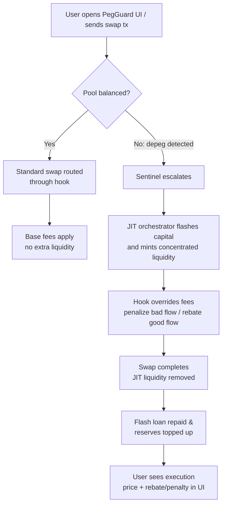

# PegGuard JIT

PegGuard JIT fuses oracle-aware risk controls with the Uniswap v4 just-in-time liquidity playbook. The result is a hook-driven stable-asset vault that:

- injects flash-loan powered liquidity bursts when a peg is at risk,
- discourages trades that widen the imbalance via oracle-driven fees, and
- rewards traders who help stabilize the pool by temporarily lowering their execution costs.

These capabilities allow the system to stay lean during calm periods while going on the offensive the moment a depeg event unfolds.

> **Competition target:** Built for the Uniswap Foundation prize pool under the *stable-asset Hooks* track, showcasing how v4 hooks can defend 1:1 pairs with adaptive fees and JIT liquidity.

## System Architecture

1. **Sentinel & Oracle Adapter** — Continuously reads Pyth price feeds for both sides of the stable pair, computes depeg severity, and tags pools as *balanced*, *at risk*, or *in crisis*.
2. **Dynamic Fee Hook** — A custom Uniswap v4 hook that overrides pool fees. It increases fees up to 5% for trades that worsen depegs and rebates users (down to 5 bps) who restore balance.
3. **JIT Liquidity Orchestrator** — Uses Aave/flash-loan providers to borrow depth only when the sentinel escalates a pool. Liquidity is added just-in-time, sits inside a tight tick band, and is pulled immediately after the trade window closes so debt can be repaid.
4. **Keeper & Automation Layer** — Off-chain executors monitor sentinel alerts, submit hook configuration updates, and trigger JIT liquidity scripts.
5. **Reserve & Treasury Manager** — Receives penalty fees, funds rebates, and enforces configurable reserve ratios per pool.

## Swap Lifecycle

1. Sentinel detects volatility (>0.5% price gap from Pyth) and flags the pool.
2. Keeper triggers the JIT orchestrator which:
   - flashes capital,
   - mints concentrated liquidity around the target tick range,
   - seeds reserve balances for rebates.
3. During the volatile window the hook:
   - levies an extra fee when a swap worsens the peg,
   - routes a rebate plus reserve contribution when the swap restores the peg.
4. After the window closes liquidity is withdrawn, flash loans are repaid, and penalty fees are streamed to the reserve.

## User Flow



From the user’s perspective, PegGuard feels like a normal Uniswap swap except during volatile windows, where the interface surfaces whether their trade helped or hurt the peg along with any rebates or surcharges applied.

## Repository Layout

```
src/        Hook contracts (currently the template Counter hook placeholder)
script/     Foundry deployment scripts (to be updated for PegGuard flows)
test/       Forge-based hook tests
```

## Getting Started

```bash
forge install       # pulls dependencies declared in foundry.toml
forge test          # runs the hook test suite
```

To experiment with scripts from the Uniswap template:

```bash
anvil --fork-url <RPC>
forge script script/00_DeployHook.s.sol --rpc-url http://localhost:8545 --private-key <KEY> --broadcast
```

## Production Development Plan

| Phase | Goal | Key Tasks |
| --- | --- | --- |
| 0. Template Hardening | Align with upstream Uniswap v4 template | Replace `Counter.sol` with the PegGuard hook skeleton, wire forge remappings, and port BaseOverrideFee + Pyth adapter components |
| 1. Oracle & Fee Logic | Enforce dynamic depeg penalties | Implement the Pyth oracle adapter and dynamic fee logic, add sentinel configuration storage, write fork tests covering fee escalations and rebates |
| 2. JIT Liquidity Engine | Burst-liquidity deployment | Build a Foundry script that borrows via flash loans (Aave or Morpho), mints liquidity within configured ticks, and tears it down post-swap |
| 3. Keeper & Monitoring | Automated response | Ship a lightweight Node.js/Foundry keeper that watches pool price + oracle feed, triggers fee mode changes, and executes the JIT script |
| 4. Risk & Treasury | Long-term sustainability | Finalize reserve token strategy, stream penalty fees into reserves, expose admin/pauser/config roles |
| 5. Production Readiness | Harden + ship | End-to-end simulations, mainnet test deployment, audits, integrate dashboards/alerting |

Short-term priorities:

1. Port oracle-aware fee math into place, replacing `Counter.sol`.
2. Scaffold flash-loan-based liquidity scripts with mocked pools on anvil.
3. Write invariant/fork tests ensuring fees never drop below the base rate and flash-loan repayment always succeeds.
4. Document keeper configuration + environment variables once automation scripts exist.

## Hackathon Delivery Roadmap

- **Day 0 – Alignment & Contracts**
  - Finalize pool assumptions (target stable pair, fee tiers, tick ranges).
  - Implement the PegGuard hook contract with oracle-driven fee overrides and reserve accounting.
  - Build oracle adapter and configuration access control so parameters can be tuned during judging.
- **Day 1 – Liquidity Engine & Tests**
  - Write Foundry scripts for JIT liquidity provisioning that borrow via flash loans (mocked locally, Aave-enabled on fork).
  - Cover hook + orchestrator interactions with fork tests, including peg-worsening/widening scenarios and repayment assertions.
- **Day 2 – Keeper & Monitoring**
  - Ship a simple automation bot (Typescript or Solidity script runner) that reads oracle deviation, toggles hook configs, and fires the JIT script.
  - Add logging/metrics hooks so demos can show historical peg defenses.
- **Day 3 – Demo Polish**
  - Package CLI commands plus a minimal web or terminal UI showing swap flow, rebates/penalties, and reserve status.
  - Record deterministic scenarios (via scripts) to replay during the hackathon pitch.

## Post-Hackathon Roadmap

1. **Multi-Pool Expansion** — Support multiple stable pairs simultaneously with pool-specific thresholds and reserve assets.
2. **Advanced Risk Controls** — Integrate volatility forecasts, circuit breakers, and asynchronous keeper voting to approve large liquidity moves.
3. **Treasury Strategy** — Automate reserve deployment into low-risk yields when idle, and expose governance controls for fee splits.
4. **Observability Suite** — Ship dashboards, on-chain event indexers, and alerting integrations for production readiness.
5. **Audit & Mainnet Rollout** — Formal verification, external audits, beta launch on L2s, followed by guarded mainnet deployment.
